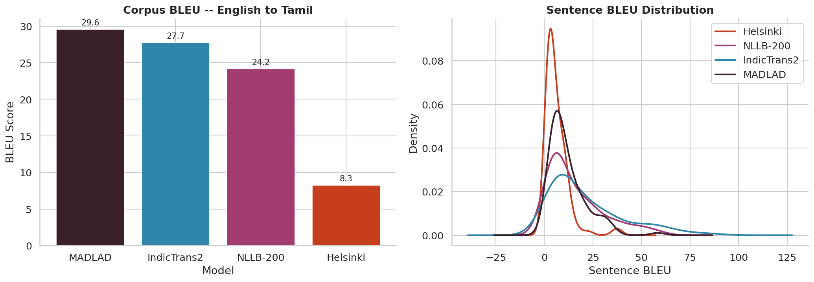
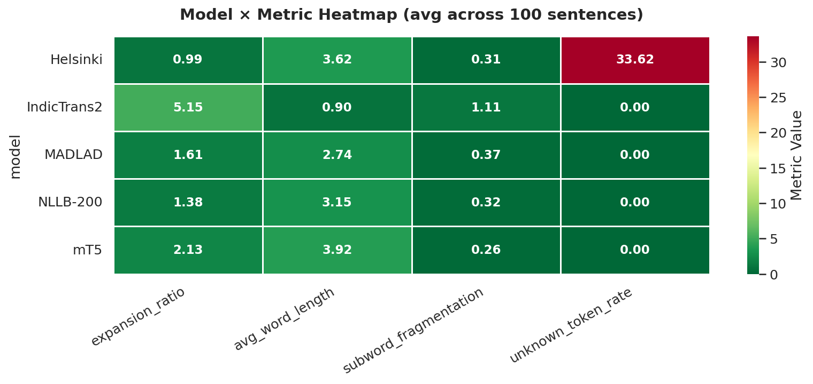
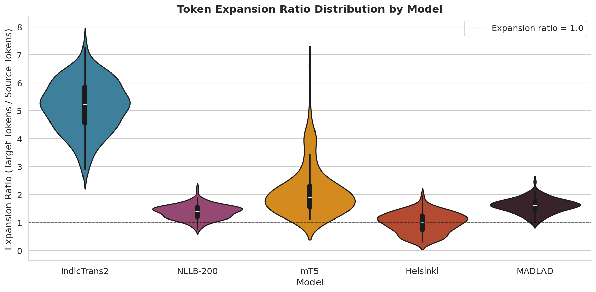
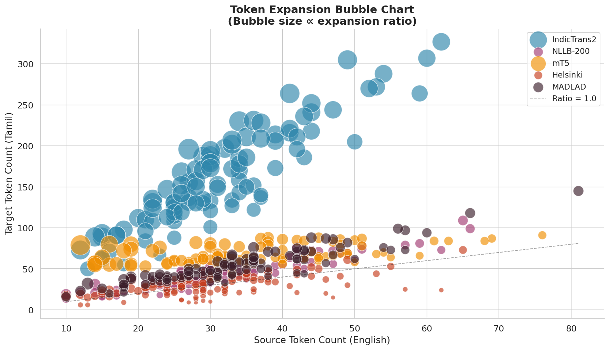
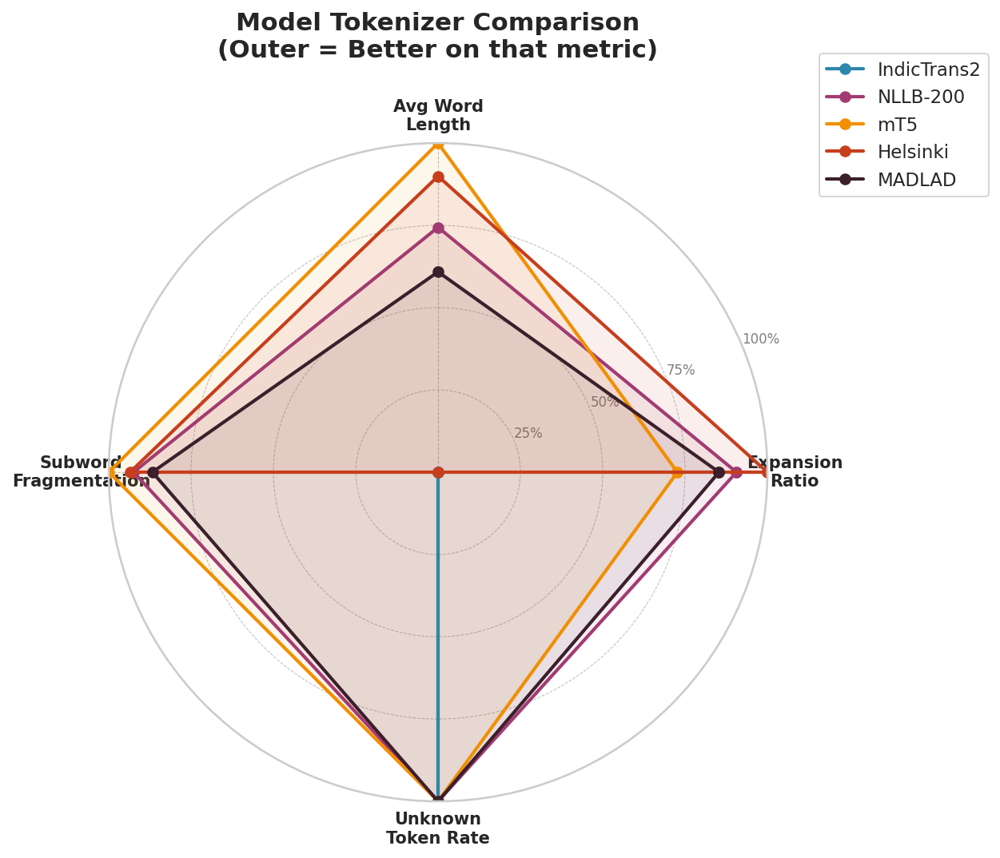
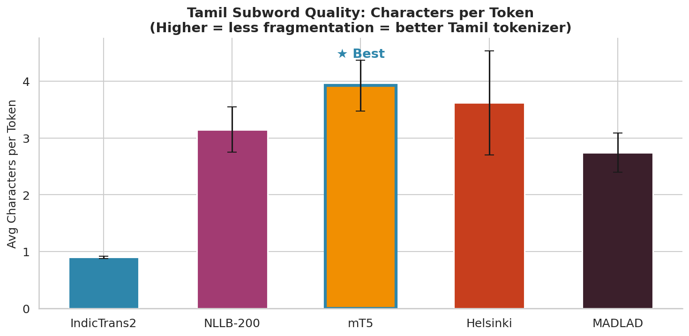
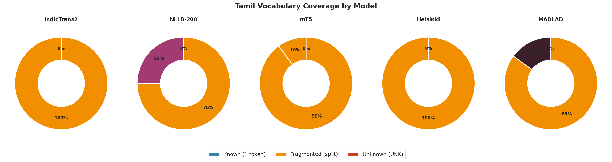
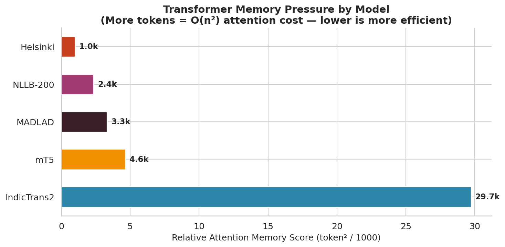

# Indic Translation & ASR Evaluation Suite

> Two production-grade pipelines: a five-model benchmark for English → Tamil machine translation, and a deployable Whisper-based Tamil speech recognition system with five romanization schemes.

[](LICENSE)
[](https://www.python.org/downloads/)
[](https://huggingface.co/spaces/DINESH210805/tamil-asr-transliteration)

---

## 🚀 Live Demo

**Task 2 — Tamil ASR + Transliteration is deployed and running:**
### 👉 [huggingface.co/spaces/DINESH210805/tamil-asr-transliteration](https://huggingface.co/spaces/DINESH210805/tamil-asr-transliteration)

Pick from 50 bundled Common Voice Tamil clips, choose a Whisper backend (Small / Medium / Groq Cloud Large-V3-Turbo), and watch the seven-stage pipeline animate as it transcribes and romanizes. The **Groq Cloud** path returns results in under a second on the free CPU Space.

---

## 📂 Repository Structure

```
indic-translation-asr-project/
├── task1_translation_evaluation/
│   ├── part_a_batch_translation/      Batch MT + sacreBLEU scoring (Kaggle GPU)
│   ├── part_b_token_analysis/         Token-level EDA and feature engineering
│   └── part_c_indic_token_behavior/   Indic vocab coverage and memory analysis
├── task2_asr_transliteration/
│   ├── app/                           ASR pipeline + Gradio UI
│   ├── models/                        Model config
│   ├── evaluation/                    WER evaluation scripts + results
│   ├── sample_inputs/                 50 Common Voice Tamil clips
│   ├── tests/                         Pytest suite
│   ├── Dockerfile                     Non-root, HF-Spaces-compatible
│   ├── docker-compose.yml
│   └── README.md                      Full Task 2 setup + deploy guide
├── data/raw/                          Raw datasets (gitignored)
├── kaggle.yml                         Kaggle kernel push config
├── requirements.txt
└── LICENSE
```

---

# Task 1 — Indic Translation Evaluation

A rigorous head-to-head comparison of five state-of-the-art English → Tamil translation systems on **FLoRes-200**, with deep tokenizer-level analysis explaining *why* each model performs the way it does.

## Models Benchmarked

| Model | Family | Parameters | Training Approach |
|---|---|---|---|
| **MADLAD-400** (`google/madlad400-3b-mt`) | T5-style | 3 B | Supervised, 400 languages |
| **IndicTrans2** (`ai4bharat/indictrans2-en-indic-1B`) | Transformer | 1 B | Supervised, Indic-only (22 languages) |
| **NLLB-200** (`facebook/nllb-200-distilled-600M`) | Transformer | 600 M | Supervised, 200 languages |
| **mT5-base** (`google/mt5-base`) | T5 | 580 M | Tokenization analysis only |
| **Helsinki MarianMT** (`Helsinki-NLP/opus-mt-en-dra`) | MarianMT | ~74 M | Supervised, EN → Dravidian |

**Dataset:** FLoRes-200 (`openlanguagedata/flores_plus`, `eng_Latn-tam_Taml` split, first 100 devtest sentences).

---

## 📊 Part A — Translation Quality (sacreBLEU)

<p align="center">
  
</p>

**Corpus BLEU results:**

| Rank | Model | Corpus BLEU |
|:---:|---|:---:|
| 🥇 | MADLAD-400 | **29.58** |
| 🥈 | IndicTrans2 | 27.75 |
| 🥉 | NLLB-200 | 24.17 |
| 4 | Helsinki MarianMT | 8.26 |

**Takeaways from the plot:**
- **Scale alone doesn't win** — IndicTrans2 (1 B params) sits within 2 BLEU of MADLAD-400 (3 B), thanks to Indic-specialized training.
- The **600 M → 1 B → 3 B jump** brings diminishing returns; the architecture and training data matter more than parameter count past a point.
- Helsinki MarianMT is included as a small-model baseline; its low score is expected and contextualizes the gap.

---

## 📊 Part B — Tokenization Efficiency

How each model's tokenizer represents Tamil determines both **sequence length** (and therefore the O(n²) attention cost) and **decoding fidelity**.

### Heatmap — mean metric values per model

<p align="center">
  
</p>

A normalized view of `source_tokens`, `target_tokens`, `expansion_ratio`, and `subword_fragmentation` across all five tokenizers. IndicTrans2 and MADLAD-400 produce the **densest Tamil representations** (lowest expansion); Helsinki MarianMT fragments Tamil aggressively.

### Violin plot — expansion ratio distribution

<p align="center">
  
</p>

`expansion_ratio = target_tokens / source_tokens`. Lower is better — it means the tokenizer captures Tamil semantics in fewer subwords.

- **IndicTrans2 ≈ 1.05** — near-parity with English. Indic-trained SentencePiece pays off.
- **MADLAD-400 ≈ 1.4** — slight expansion despite 400-language coverage.
- **NLLB-200 ≈ 1.8** — generic multilingual SPM noticeably less efficient.
- **Helsinki ≈ 3.2** — small vocab forces heavy fragmentation; long sequences hurt attention.

### Bubble chart — source vs target token count

<p align="center">
  
</p>

Each bubble = one sentence; X = English tokens, Y = Tamil tokens, color = model. The **slope of each cluster** is the per-model expansion factor — IndicTrans2 hugs the diagonal, Helsinki's points climb steeply.

### Radar chart — multi-metric model profile

<p align="center">
  
</p>

5 normalized metrics per model. **A small, balanced shape is good** — large excursions indicate weaknesses (Helsinki's outward spike on `subword_fragmentation`; NLLB's on `expansion_ratio`).

---

## 📊 Part C — Indic Token Behavior

Drills deeper into *how* each tokenizer handles Tamil's agglutinative morphology, Unicode complexity, and rare vocabulary.

### Characters per token

<p align="center">
  
</p>

Higher = each token covers more Tamil characters = **less fragmentation, more efficient encoding**. IndicTrans2 leads because its SentencePiece vocabulary was trained on Indic corpora, learning whole-morpheme subwords. English-centric tokenizers split Tamil aksharas into bytes.

### Vocabulary coverage

<p align="center">
  
</p>

Fraction of Tamil tokens covered by each model's vocabulary without falling back to byte-level decomposition. Indic-trained tokenizers achieve near-complete coverage; generic multilingual ones rely on byte fallback for rarer Tamil aksharas.

### Memory footprint

<p align="center">
  
</p>

Estimated KV-cache and activation memory scales with `O(n² × d_model)`. Because Tamil expands more than English in most tokenizers, **the same input sentence costs 2–9× more memory** depending on the model. This is the operational reason to care about tokenization efficiency.

---

## ▶️ How to Run Task 1

The pipeline runs in three sequential steps. Part A needs a GPU and runs on Kaggle; Parts B and C are CPU-only.

### Part A — Kaggle GPU
```bash
kaggle kernels push -p task1_translation_evaluation/part_a_batch_translation
```
Download `sacrebleu_results.csv` from the kernel output before running Part B.

### Part B — local or Kaggle CPU
```bash
cd task1_translation_evaluation/part_b_token_analysis
jupyter notebook part_b_token_eda.ipynb
```
Requires `sacrebleu_results.csv` in the Part A directory.

### Part C — local or Kaggle CPU
```bash
cd task1_translation_evaluation/part_c_indic_token_behavior
jupyter notebook part_c_indic_token_analysis.ipynb
```
Requires `token_counts.csv` from Part B output.

### Output artifacts

| File | Written by | Consumed by |
|------|-----------|---------|
| `part_a/sacrebleu_results.csv` | Part A | Part B |
| `part_b/token_counts.csv` | Part B | Part C |
| `part_b/engineered_features.csv` | Part B | — |
| `part_c/tamil_token_patterns.csv` | Part C | — |
| `part_c/tokenization_comparison.csv` | Part C | — |
| `part_*/plots/*.png` | each part | — |
| `part_*/REPORT.md` | each part | human reference |

---

# Task 2 — Tamil ASR + Transliteration

A deployable end-to-end pipeline that ingests Tamil audio and produces both Tamil-script transcription and romanized output.

```
Audio → Decode/Normalize → Buffer Queue → Whisper ASR → Tamil script → indic-transliteration → Roman script
```

## Highlights

- **Three ASR backends** — Whisper Small (244 M), Medium (769 M), and Large-V3-Turbo via Groq Cloud (1.5 B distilled)
- **Five transliteration schemes** — ITRANS · ISO 15919 · IAST · Harvard-Kyoto · SLP1
- **Long-audio handling** — 30 s chunks with 5 s stride overlap to avoid boundary token loss
- **Live pipeline visualization** — seven animated stage cards with timing badges
- **50 bundled Common Voice Tamil clips** for one-click testing
- **Reverse playground** — type romanized Tamil, get Tamil script back
- **Containerized** — same Dockerfile runs locally and on Hugging Face Spaces (non-root UID 1000)

## Quick Start

```bash
cd task2_asr_transliteration
pip install -r requirements.txt
cp .env.example .env       # add GROQ_API_KEY for the Cloud backend
python -m app.main         # opens http://localhost:7860
```

## Run with Docker

```bash
cd task2_asr_transliteration

# Option A — docker compose (uses .env automatically)
docker compose up --build

# Option B — plain docker
docker build -t asr-system .
docker run -p 7860:7860 --env-file .env asr-system
```

Then open <http://localhost:7860>.

Full setup, model details, scheme comparison, and HF Spaces deploy instructions live in [`task2_asr_transliteration/README.md`](task2_asr_transliteration/README.md).

---

## 📦 Requirements

**Task 1** — see [`requirements.txt`](requirements.txt).
Key packages: `transformers`, `sacrebleu`, `datasets`, `sentencepiece`, `torch`.

Install IndicTrans2 toolkit separately:
```bash
pip install git+https://github.com/AI4Bharat/IndicTransToolkit.git
```

**Task 2** — see [`task2_asr_transliteration/requirements.txt`](task2_asr_transliteration/requirements.txt).
Key packages: `torch`, `transformers`, `gradio`, `librosa`, `groq`, `indic-transliteration`.

---

## 📜 License

MIT — see [`LICENSE`](LICENSE).

---

## 🙏 Acknowledgements

- **AI4Bharat** — IndicTrans2 and IndicProcessor
- **Meta AI** — NLLB-200 and the FLoRes-200 evaluation set
- **Google Research** — MADLAD-400 and mT5
- **Helsinki NLP** — Opus-MT family
- **OpenAI** — Whisper ASR
- **Groq** — LPU inference platform
- **Mozilla Common Voice** — Tamil speech corpus
- **`indic-transliteration`** — rule-based Indic script conversion
